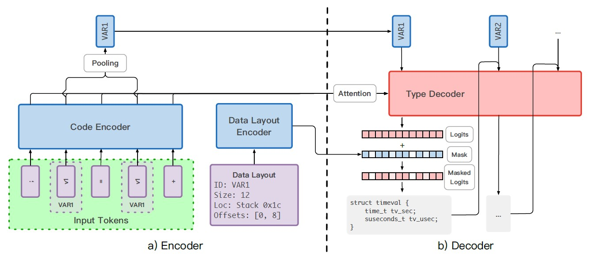

## Augmenting Decompiler Output with Learned Variable Names and Types

[Augmenting Decompiler Output with Learned Variable Names and Types](https://www.usenix.org/conference/usenixsecurity22/presentation/chen-qibin)

### Method

#### Transformers

The authors cast the retyping problem as the transformation from a sequence of tokens representing the decompiled code to a sequence of types, and adopt transformers to achieve the sequence-to-sequence transformations. Input is decompiled code preprocessed with byte-pair encoding (BPE). Output is the retype and rename of the variables. 

#### Code Encoder

The encoder converts the sequence of code tokens of decopiled funtion, $x=(x_1, x_2, ..., x_n)$, into a sequence of representations:

$$H=(h_1, h_2, ..., h_n)$$

A variable can appear multiple times in the code tokens of a function, the authors use average pooling to summarize all appearances of a variable to a identifier.

$$v_t=AveragePool_{x_i \in A_t}h_i, t=1, ..., m$$

#### Type Decoder

Given the encoding of the decompiled tokens, the decoder predicts the most probable types for all variables in the function.

Take the encoded representations ($H$) and identifiers ($v_t$) as input, and predict the original types for all variables.

The decoder predicts the output step-by-step using dormer predictions as input for later ones.

#### Data Layout Encoder

The authors encode data layout information and use this information as a hard constraint on the decoder's predictions, which is a *soft mask* that sets the probability of any "incompatible" types to a small percentage.

#### Multi-Task

The authors introduce multi-task to predict types and names in parallel. The first time the decoder is invoked on the t-th variable, it outputs the predicted type and the second time it outputs a predicted name.

### Evaluation

The authors have conducted a large number of experiments, and various experimental results are shown in the following figures.

