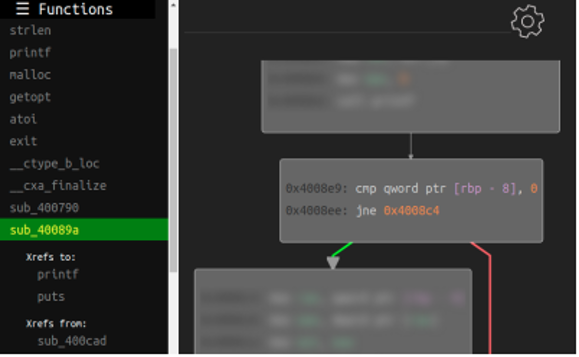
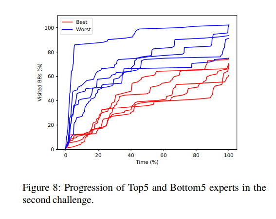
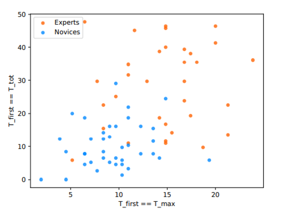

# RE-Mind: a First Look Inside the Mind of a Reverse Engineer (USENIX Security' 23)

## Method

The authors design an online platform that looks like an interactive disassembler for collecting data, as shown below:

Among 72 participants, there are 33 experts and 39 novices. The platform contains two programs that decide to print the string "success" or not based on the provided input. The participants are required to answer what input should be fed to make the program output "success". 

## Findings

### Function Exploration

There are three typical strategies for deciding the order of analyzing functions.

+ Forward  - start from the `main` function and  walk along the CFG
+ Backward - start from the function that prints "success" then analyze the callers
+ Sequential - click the functions in the navigator in the left column and ignore the call relationship

Frequency: Forward > Backward > Sequential for both novices and experts.

While encountering `call` instruction, the participants have three typical choices:

+ Depth-first - go along the call instruction and step into the corresponding function
+ Breadth-first - step into the invoked function after analyzing the current function
+ Hybrid - adopt both depth-first and breadth-first strategies

Frequency: Hybird > Breadth-first > Depth-first

### Code Selection

Useless blocks represent the basic blocks that the participant does not need to analyze to get the right input. Novices spend more time on useless blocks compared with experts.

### Birdeye Overview 

+ Experts analyzed less basic blocks.
+ Experts is more linear.

### Basic Block Exploration

+ Experts are more likely to analyze the basic block only once.
+ For experts, the first time they analyze some basic block is more likely to be the longest time they analyze this basic block.

### Speed Factor

+ The length of instructions does not significantly affect the analyzing time.
+ For both experts and novices, the basic blocks related to preparing call parameters are more time-consuming.
+ For novices (but not experts), the basic blocks containing (1) uncommon instructions, (2) operation on in-memory data, and (3) operation on static strings are more time-consuming.